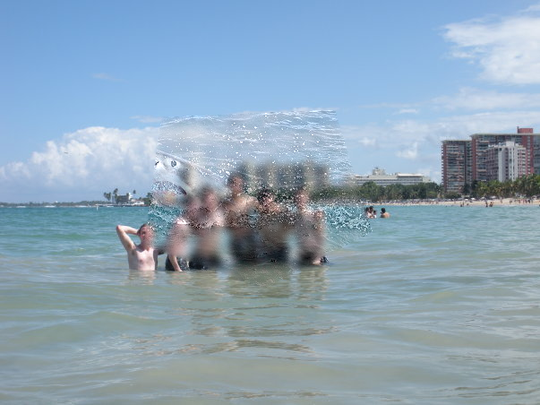
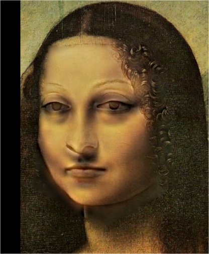

# 作业 02：DIP with PyTorch

## 1. 作业目标

本次作业包含两个部分：

1. 用 PyTorch 实现传统数字图像处理任务：Poisson Image Editing。
2. 用 PyTorch 实现深度学习图像到图像翻译任务：Pix2Pix-style FCN。

代码文件已经按可直接放入 GitHub repository 的形式整理，核心实现位于
`run_blending_gradio.py` 与 `Pix2Pix/FCN_network.py`。

## 2. Poisson Image Editing

### 2.1 Polygon to Mask

`create_mask_from_points()` 根据用户点击得到的多边形顶点生成二值 mask：

- 多边形外部像素为 `0`。
- 多边形内部像素为 `255`。
- 使用 `PIL.ImageDraw.polygon()` 对多边形区域进行栅格化。

### 2.2 Laplacian Distance

`cal_laplacian_loss()` 使用 PyTorch 的 `torch.nn.functional.conv2d` 计算 4 邻域
Laplacian：

```text
0   1   0
1  -4   1
0   1   0
```

对 RGB 三个通道使用 grouped convolution，随后只在前景 mask 与背景目标 mask
对应的区域内计算均方误差：

```text
loss = MSE(Laplacian(blended)[target_mask],
           Laplacian(foreground)[source_mask])
```

优化时只允许目标图像 mask 内区域更新，mask 外区域保持背景图不变。这样既保留了
目标图像边界，又让粘贴区域继承源图像的梯度结构。

### 2.3 运行方式

交互式运行：

```bash
python run_blending_gradio.py
```

生成固定示例结果：

```bash
python scripts/run_poisson_examples.py
```

示例输出：






## 3. Pix2Pix-style FCN

### 3.1 数据集

PPT 要求使用样本量更多的数据集验证流程，因此不只依赖模板里的 facades。提交中提供了
通用下载脚本，推荐使用 pix2pix 官方 `maps` 数据集：

```bash
cd Pix2Pix
bash download_pix2pix_dataset.sh maps
```

脚本会生成：

- `train_list.txt`
- `val_list.txt`

数据集不会提交到 GitHub，已在 `.gitignore` 中忽略。

### 3.2 网络结构

`FullyConvNetwork` 是一个全卷积 encoder-decoder：

- Encoder：4 个 stride-2 `Conv2d` block，将输入图逐步下采样。
- Decoder：4 个 stride-2 `ConvTranspose2d` block，将特征图恢复到原分辨率。
- 输出层使用 `Tanh()`，与数据归一化范围 `[-1, 1]` 对齐。

该结构不使用全连接层，因此可以处理标准 pix2pix paired image 的图像到图像翻译任务。

### 3.3 训练与验证

训练命令：

```bash
python train.py --input-side left --epochs 200 --batch-size 16
```

如果数据集中输入图位于右半边，可改为：

```bash
python train.py --input-side right
```

训练输出：

- `results/history.csv`：每个 epoch 的训练 L1 loss 与验证 L1 loss。
- `results/train/`：训练集输入、目标、输出拼接图。
- `results/val/`：验证集输入、目标、输出拼接图。
- `checkpoints/`：模型权重。

## 4. 验证

轻量检查脚本：

```bash
python scripts/smoke_test.py
```

检查内容：

- 多边形 mask 是否能正确生成。
- Laplacian loss 是否能反向传播到 blended image。
- Pix2Pix FCN 输入输出尺寸是否一致，输出范围是否位于 `[-1, 1]`。

## 5. 总结

本提交完成了 README 与 PPT 中要求的两个核心实现：

- Poisson Image Editing：用 PyTorch convolution 与优化器完成传统 DIP。
- Pix2Pix-style FCN：完成数据读取、网络构建、训练、验证、保存结果的完整流程。

大规模 pix2pix 数据集与训练结果文件体积较大，按 GitHub 项目规范不直接提交；运行
`Pix2Pix/download_pix2pix_dataset.sh` 与 `Pix2Pix/train.py` 即可复现实验。
