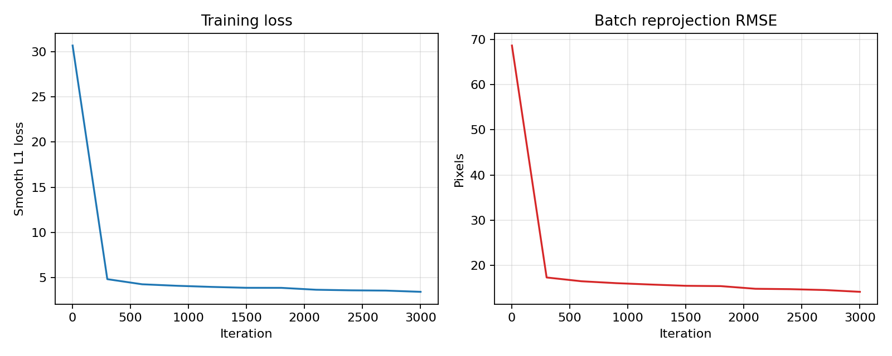
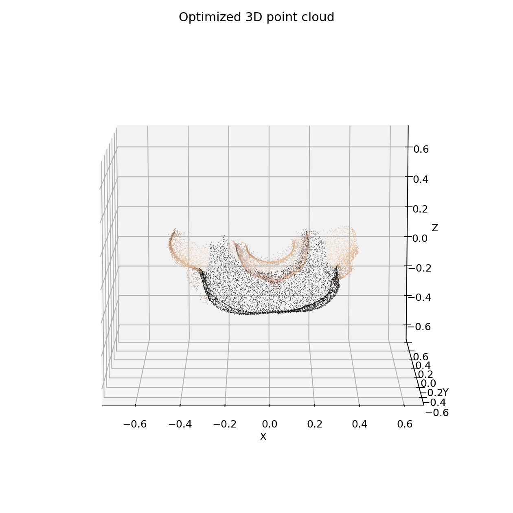

# Assignment 03 Report: Bundle Adjustment

## Task 1: Bundle Adjustment with PyTorch

### Problem Setup

The assignment provides 50 rendered views and 2D observations for 20000 points.
For each visible observation, the goal is to optimize:

- shared focal length `f`
- per-view camera extrinsics `R, T`
- 3D point coordinates `X, Y, Z`

The implementation is in `src/ba_torch.py`.

### Projection Model

The camera transform follows the assignment convention:

```text
[Xc, Yc, Zc]^T = R @ [X, Y, Z]^T + T
```

The projection equations are:

```text
u = -f * Xc / Zc + cx
v =  f * Yc / Zc + cy
```

where `cx = image_width / 2` and `cy = image_height / 2`.

### Parameterization and Initialization

Rotation is parameterized by XYZ Euler angles and converted to rotation matrices
inside PyTorch. The focal length is optimized as:

```text
f = initial_focal * exp(log_focal_scale)
```

so it always stays positive. The 3D points are initialized from the mean visible
2D coordinates with a default depth of 3.0. Translations are initialized to
`[0, 0, -3]`. The default camera yaw initialization spans the known front-view
range of `[-70 deg, 70 deg]`; it can be set to zero with
`--init-yaw-range-deg 0`.

### Objective

The optimized loss is a masked robust reprojection loss:

```text
loss = SmoothL1(projected_2d - observed_2d) + center_regularization + focal_regularization
```

Only observations whose visibility flag is 1 are used. Mini-batches are sampled
over 3D point tracks, while all 50 views are evaluated for the sampled points.

### How to Reproduce

```powershell
conda run -n pytorch python src/ba_torch.py --data-dir data --output-dir outputs/task1 --device auto --iters 3000 --point-batch 4096
```

### Results

The included Task 1 run uses 3000 optimization iterations. Final full-dataset
metrics from `outputs/task1/metrics.json`:

```text
RMSE: 14.0714 px
MAE:   9.7980 px
Visible observations: 805089
Optimized focal length: 1821.13 px
```

Loss curve:



Point cloud preview:



Generated colored point cloud:

```text
outputs/task1/reconstruction.obj
```

Camera and metric files:

```text
outputs/task1/camera_params.npz
outputs/task1/metrics.json
```

## Task 2: 3D Reconstruction with COLMAP

The lecture slides describe this part as a COLMAP usage task with no additional
code requirement. The repository includes command-line scripts for both Windows
and Unix.

Windows:

```powershell
powershell -ExecutionPolicy Bypass -File scripts/run_colmap.ps1
```

Unix:

```bash
bash scripts/run_colmap.sh
```

The pipeline performs:

1. Feature extraction
2. Exhaustive feature matching
3. Sparse reconstruction with COLMAP mapper
4. Image undistortion
5. PatchMatch stereo
6. Stereo fusion

Expected outputs:

```text
data/colmap/sparse/0/
data/colmap/dense/fused.ply
```

The dense point cloud can be opened with MeshLab or CloudCompare:

```text
data/colmap/dense/fused.ply
```
